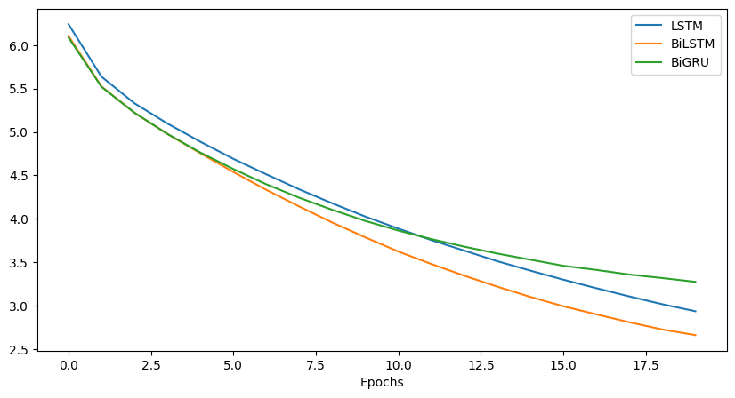

#### 1
# Next Word Predictor (LSTM)

PyTorch LSTM model for next-word prediction using pickup lines. Currently underperforms due to training and data issues.

## Training Results
Trained 49 epochs (Adam, lr=0.001). Recent losses:
- Epoch 45: 0.3571
- Epoch 46: 0.4156
- Epoch 47: 0.5037
- Epoch 48: 0.5370
- Epoch 49: 0.2698

Loss fluctuates; predictions often incorrect.

## Example
**Input**: `why you pay`  
**Output**: `why you pay know pay seen for are pay have to a from you me`  
Output is repetitive and incoherent.

## Challenges
- Unstable model performance.
- Text preprocessing issues (emojis, rare words).
- Limited dataset quality.

## Future Improvements
- Cleaner/larger dataset.
- Better preprocessing, validation.

## Mistakes I made while making this model
- Softmaxing 
- Not doing this ```torch.argmax(y, dim=1)```
I have not yet gone deep why can we work with one hot encodded problem directly

#### 2
I want not able to train this model at first.

The problem was I was using left padding which was converting [1,2] --> [1, 2, 0, 0] (each numnber represent a word)
In every prediction the model was getting confused becasues after 0 there always came a new word something random.
but soon after changing into right padding [1, 2] --> [0, 0, 1, 2] then finally model was able to learn.



| Models    | Losses |
| -------- | ------- |
| LSTM | Loss: 2.9354 |
| BiLSTM | Loss: 2.6607 |
| BiGRU |Loss: 3.2744 |

---
## Inference
1. Download the project
2. Open inference folder in terminal
3. Run ```python app.py```